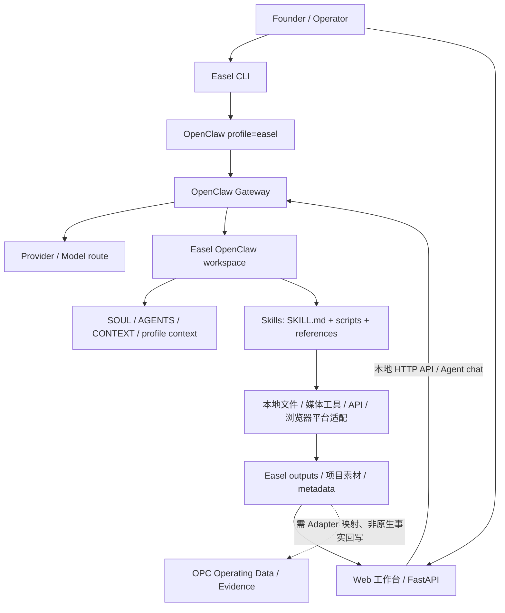

# Easel Capability Audit Report

> 审计基线：Easel `ZJU-REAL/Easel`，commit `4b9c03cf2129b6155595b66fc1e604546a3aa4ad`；Windows 本机 OpenClaw profile=`easel`；workspace Skills 目录静态扫描。  
> 参照：本机可读的 `X-SuperPlay-OPC-Blueprint`、`X-SuperPlay-ContentOps`。本报告只审阅源码、README、文档及 Skill 定义；未调用 Gateway/模型、未执行 Skill/业务 workflow、未登录平台、未写入其他仓库。

## 1. Executive Summary

- Easel 是 **OpenClaw 驱动的创作者内容执行 Runtime**：CLI 管理入口，Web/FastAPI 提供本地工作台与 API，OpenClaw profile/Gateway 提供 Agent 会话和模型调用，Workspace 承载上下文，Skills 调用脚本/API/浏览器并将产物归档到项目输出。
- 安装 workspace 当前发现 **114 个 `SKILL.md`**。按其 frontmatter 的 layer 计数：发现 9、策划 16、创作 52、发布 20、归因 11、通用 6。README badge 写 113，与本地固定 commit 实际 114 有一项差异；此报告按本机 workspace 文件计数。
- Easel 对 WS-008 的 **发现、选题辅助、平台改写、内容生产、执行层发布工具、基础数据复盘**有较强覆盖，适合作为内容操作执行器/Skill 引擎。
- Easel **不能替代** OPC Blueprint 的业务事实源、机会/证据判定、claim/permission 规则、人工审批、商业状态、经营账本与商业验证闭环。Blueprint 明确将 Runtime 和业务契约分开，AI Agent 不是 business source of truth。
- 可见的 `X-SuperPlay-ContentOps` 本地文件是一份 Easel/WS-008 研究与决策文档，并非独立可运行的 ContentOps Runtime。直接审阅 GitHub `X-SuperPlay-Strategy@c1513bb` 后确认：Strategy 是 WS-008 的 Content-to-Startup OS，实现 Source Artifact/Experiment/Platform Adapter/指标/复盘到问题验证的运行策略；其中视频/图文制作流程定位为 Renderer。
- 推荐 **Plan B：Easel + 受治理的业务 Adapter**。Easel 执行内容工作，Strategy/WS-008 负责可调用适配与映射，Blueprint 继续掌握事实、门禁与证据生命周期。小范围先以人工审批和草稿模式验证，结构化回执/指标回写通过契约验收后再考虑自动化。

### 审计口径和限制

“能力存在”指当前 commit 的 Skill 文档、CLI/Web 代码或 Blueprint 契约中有明确描述；不等于本次验证了外部 API、模型服务、平台账号、发布或指标抓取实际可用。Skill 的自动化价值只评价是否适合作为机器执行步骤，不代表可绕过人工批准、平台规则或 OPC 证据门禁。

## 2. Easel 架构图与职责



| 模块 | 职责 | 输入 / 输出 | 扩展点与边界 |
| --- | --- | --- | --- |
| CLI (`easel/cli.py`) | `chat`、`doctor`、`gateway`、`ping`、`skill` 等入口；固定选择 `--profile easel`，解析 OpenClaw 命令 | 终端参数/对话 → Agent 命令、健康状态、Skill 调用 | 新增命令/外围调用包装；业务链仍主要由 Skill 定义 |
| Web (`web/app.py`, `web/static/`) | FastAPI 本地服务、工作台前端、会话流、Skills/画像/输出浏览、部分本地配置 API | 浏览器 HTTP/SSE ↔ FastAPI ↔ Gateway/本地文件 | API/UI 可扩展；带写入能力的接口需保留本地写保护与输入校验 |
| OpenClaw integration | 独立 `easel` profile、状态目录、模型 provider、Agent 和 Gateway | Easel CLI/Web → Gateway → provider/model → Agent | OpenClaw 配置和 Agent/runtime 插件；保持 profile 隔离，模型路由不是业务治理层 |
| Skills system | 按需加载 `SKILL.md` 指令；脚本和共享库执行媒体/数据/平台动作 | 自然语言任务 + 文件/配置 → 草稿、媒体、状态或报告 | 新 Skill、共享脚本、Skill 元数据；副作用由具体 Skill 实现，不能因有 Skill 就假设安全/可用 |
| Workspace | OpenClaw 的上下文与 Skill 发现位置；存放系统提示、项目上下文、Skills 镜像 | 常驻上下文 + 动态 Skill 描述 → Agent 执行边界与可发现能力 | `AGENTS.md`/`CONTEXT.md` 等上下文、同步 Skill；配置按用户/运行时状态管理 |
| Profile（创作者画像） | 六维 Markdown 上下文：定位、风格、受众、平台、偏好、记忆；注入会话和 Skill | 用户提供资料/允许分析的公开资料 → 持久画像文件 | profile 模板/字段和画像流程；**不是** OPC 商业主体/机会/证据 Profile |
| Gateway | 常驻 OpenClaw Agent 服务；承接 Web/CLI Agent 请求、事件流和状态健康检查 | Agent 请求 ↔ 模型与工具运行 | OpenClaw Gateway endpoint/config；端口由 Easel/OpenClaw 运行时解析 |
| Runtime model layer | OpenClaw 的 provider/model/auth 配置及 Agent 请求运行 | 已配置凭证 + model route + prompt → 模型响应 | OpenClaw provider/model 注册；密钥和模型可用性属于运行配置，不包含 OPC 事实裁决 |

### 调用关系与数据流

1. 操作者通过 CLI 或 Web 发起任务；Web 读取本地状态/Skill 索引，Agent 对话走隔离的 OpenClaw Gateway。
2. OpenClaw 将 workspace 上下文与被选中的 Skill 描述组装给 Agent；Skill 再按说明调用共享脚本、命令行工具、第三方 API 或浏览器自动化。
3. 产物主要落入 Easel `outputs/` 项目目录并带项目元数据；会话和产物可在本地工作台查看。
4. 读取到的表现数据可用于 Easel 自身分析/画像沉淀，但 **OPC 需要的 Source Artifact ID、claim/permission references、审批记录、publish receipt、标准化 Metric Snapshot、Market Signal、Evidence promotion 并非仅靠“写入 outputs”就自动闭环**；需由 Adapter 和 OPC 数据契约完成映射。

### 扩展位置

- **Skill 扩展**：遵循 `docs/SKILL-SPEC.md`，在 Skill 文档中说明输入/输出、执行步骤、profile 感知和产物管理；共享脚本位于 `skills/shared/`。
- **运行集成**：Easel/OpenClaw CLI、workspace 同步、Gateway 和 Web API 是外部集成入口；调用端须绑定 profile、会话、产物和错误/重试语义。
- **业务适配**：应作为 OPC/WS-008 侧的 Adapter/契约层，避免把商机、证据裁决、商业状态机或本地治理塞入 Easel Skill/上游核心。
- **平台适配**：Easel 已有平台 Skills/工具，但应受 Platform Adapter contract、账号授权、平台规则和发布审批约束。

## 3. Skills 地图

### 统计和一级分类

| 一级分类（Skill frontmatter `layer`） | 数量 | 典型能力 |
| --- | ---: | --- |
| discover | 9 | 热榜、资讯、RSS、竞品、UGC、内容缺口、事件日历、跨平台差异、算法动态 |
| plan | 16 | 账号/受众定位、选题评估、内容策略/矩阵/日历、活动、Hook、脚本规划、趋势借势 |
| produce | 52 | 文案、图卡/信息图/海报、AI 图像/音视频、剪辑、字幕、配音、短剧、论文解读、格式转换 |
| publish | 20 | 质量/风险检查、平台适配、发布编排、账号互动、平台发布与通知 |
| attribute | 11 | 发布日志、账号/内容指标、评论洞察、复盘、ROI、策略建议 |
| general | 6 | 素材资产管理、批处理、账号/Profile 管理、模板库 |
| **合计** | **114** | 当前安装 workspace 中的 `*/SKILL.md`；README badge 标示 113，属于文档数字与固定 commit 实际文件数差异 |

二级能力按 OPC 操作链可归纳为：

- **情报发现**：实时热榜/行业新闻/RSS/UGC/竞品/节日事件/算法变化/跨平台内容差异。
- **需求与策划**：账号诊断、受众/定位/声音、Topic 评分和趋势借势、内容矩阵/日历/活动/直播/合作规划。
- **资产生产**：通用文案/小红书笔记/文章/小说/视频脚本；图像、卡片、海报、图表、信息图、思维导图；TTS/音频处理/音乐；视频生成、剪辑、切片、字幕、重构、合成。
- **发布治理和平台执行**：Persona/风险/质量/SEO/Checklist；平台适配、排期、发布日志、通知、评论与平台发布器。
- **运营归因**：内容/账号指标记录、评论洞察、发布分析、内容复盘、候选策略建议、ROI 计算。
- **通用资产管理**：素材库/批处理/模板/Profile 的本地辅助。

### Skill 逐项能力表

下表完整列出安装 workspace 的 114 个 Skills。输入/输出按 Skill 文档的 `输入`/`输出` 或流程描述压缩归类；外部依赖标注为静态文档审阅的典型依赖，不代表本次已运行验证。自动化价值：高=适合可重复、可检查的机器步骤；中=需要外部数据/API、素材或人工判断；低/受门控=具备副作用，必须人审/平台授权后才执行。

| Skill | 类型 | 输入 | 输出 | 外部依赖 | 自动化价值 |
| --- | --- | --- | --- | --- | --- |
| `ai-image-gen` | 创作 | Brief/文本/素材/媒体参数 | 文稿、图像、音频、视频或本地项目文件 | 本地输入/工具；外部生成 API/密钥按具体能力可选 | 中高；步骤可编排，付费调用/质量需确认 |
| `ai-music` | 创作 | Brief/文本/素材/媒体参数 | 文稿、图像、音频、视频或本地项目文件 | 本地输入/工具；外部生成 API/密钥按具体能力可选 | 中高；步骤可编排，付费调用/质量需确认 |
| `ai-video-gen` | 创作 | Brief/文本/素材/媒体参数 | 文稿、图像、音频、视频或本地项目文件 | 本地输入/工具；外部生成 API/密钥按具体能力可选 | 中高；步骤可编排，付费调用/质量需确认 |
| `asset-manager` | 通用 | 文件/资产/Profile/管理请求 | 整理后的资产、模板或本地元数据 | 本地文件或用户提供信息；外部账号非默认前提 | 高；适合受控本地整理 |
| `audio-denoise` | 创作 | Brief/文本/素材/媒体参数 | 文稿、图像、音频、视频或本地项目文件 | 用户输入文件/本地媒体工具（按该 Skill 需要） | 高；确定性处理可自动化，素材权利需核验 |
| `audio-editing` | 创作 | Brief/文本/素材/媒体参数 | 文稿、图像、音频、视频或本地项目文件 | 用户输入文件/本地媒体工具（按该 Skill 需要） | 高；确定性处理可自动化，素材权利需核验 |
| `audio-mix` | 创作 | Brief/文本/素材/媒体参数 | 文稿、图像、音频、视频或本地项目文件 | 用户输入文件/本地媒体工具（按该 Skill 需要） | 高；确定性处理可自动化，素材权利需核验 |
| `audio-visualizer` | 创作 | Brief/文本/素材/媒体参数 | 文稿、图像、音频、视频或本地项目文件 | 用户输入文件/本地媒体工具（按该 Skill 需要） | 高；确定性处理可自动化，素材权利需核验 |
| `auto-short-video` | 创作 | 主题/文案、画幅与素材/服务选择 | 视频及 storyboard/中间素材 | 本地输入/工具；外部生成 API/密钥按具体能力可选 | 中高；步骤可编排，付费调用/质量需确认 |
| `auto-subtitle` | 创作 | Brief/文本/素材/媒体参数 | 文稿、图像、音频、视频或本地项目文件 | 用户输入文件/本地媒体工具（按该 Skill 需要） | 高；确定性处理可自动化，素材权利需核验 |
| `batch-process` | 通用 | 文件/资产/Profile/管理请求 | 整理后的资产、模板或本地元数据 | 用户输入文件/本地媒体工具（按该 Skill 需要） | 高；确定性处理可自动化，素材权利需核验 |
| `beat-sync-video` | 创作 | Brief/文本/素材/媒体参数 | 文稿、图像、音频、视频或本地项目文件 | 用户输入文件/本地媒体工具（按该 Skill 需要） | 高；确定性处理可自动化，素材权利需核验 |
| `card-design` | 创作 | Brief/文本/素材/媒体参数 | 文稿、图像、音频、视频或本地项目文件 | 用户输入文件/本地媒体工具（按该 Skill 需要） | 高；确定性处理可自动化，素材权利需核验 |
| `card-quote` | 创作 | Brief/文本/素材/媒体参数 | 文稿、图像、音频、视频或本地项目文件 | 用户输入文件/本地媒体工具（按该 Skill 需要） | 高；确定性处理可自动化，素材权利需核验 |
| `card-xiaohongshu` | 创作 | Brief/文本/素材/媒体参数 | 文稿、图像、音频、视频或本地项目文件 | 用户输入文件/本地媒体工具（按该 Skill 需要） | 高；确定性处理可自动化，素材权利需核验 |
| `chart-visualization` | 创作 | Brief/文本/素材/媒体参数 | 文稿、图像、音频、视频或本地项目文件 | 用户输入文件/本地媒体工具（按该 Skill 需要） | 高；确定性处理可自动化，素材权利需核验 |
| `clipify` | 创作 | Brief/文本/素材/媒体参数 | 文稿、图像、音频、视频或本地项目文件 | 本地文件或用户提供信息；外部账号非默认前提 | 高；适合受控本地整理 |
| `comparison-card` | 创作 | Brief/文本/素材/媒体参数 | 文稿、图像、音频、视频或本地项目文件 | 用户输入文件/本地媒体工具（按该 Skill 需要） | 高；确定性处理可自动化，素材权利需核验 |
| `copywriting` | 创作 | Brief/文本/素材/媒体参数 | 文稿、图像、音频、视频或本地项目文件 | 本地输入/工具；外部生成 API/密钥按具体能力可选 | 中高；步骤可编排，付费调用/质量需确认 |
| `data-report` | 创作 | Brief/文本/素材/媒体参数 | 文稿、图像、音频、视频或本地项目文件 | 本地文件或用户提供信息；外部账号非默认前提 | 高；适合受控本地整理 |
| `doc-convert` | 创作 | Brief/文本/素材/媒体参数 | 文稿、图像、音频、视频或本地项目文件 | 用户输入文件/本地媒体工具（按该 Skill 需要） | 高；确定性处理可自动化，素材权利需核验 |
| `ecom-details-image` | 创作 | Brief/文本/素材/媒体参数 | 文稿、图像、音频、视频或本地项目文件 | 本地输入/工具；外部生成 API/密钥按具体能力可选 | 中高；步骤可编排，付费调用/质量需确认 |
| `green-screen` | 创作 | Brief/文本/素材/媒体参数 | 文稿、图像、音频、视频或本地项目文件 | 用户输入文件/本地媒体工具（按该 Skill 需要） | 高；确定性处理可自动化，素材权利需核验 |
| `gzh-design` | 创作 | Brief/文本/素材/媒体参数 | 文稿、图像、音频、视频或本地项目文件 | 用户输入文件/本地媒体工具（按该 Skill 需要） | 高；确定性处理可自动化，素材权利需核验 |
| `image-editing` | 创作 | Brief/文本/素材/媒体参数 | 文稿、图像、音频、视频或本地项目文件 | 用户输入文件/本地媒体工具（按该 Skill 需要） | 高；确定性处理可自动化，素材权利需核验 |
| `image-enhance` | 创作 | Brief/文本/素材/媒体参数 | 文稿、图像、音频、视频或本地项目文件 | 用户输入文件/本地媒体工具（按该 Skill 需要） | 高；确定性处理可自动化，素材权利需核验 |
| `infographic` | 创作 | Brief/文本/素材/媒体参数 | 文稿、图像、音频、视频或本地项目文件 | 本地输入/工具；外部生成 API/密钥按具体能力可选 | 中高；步骤可编排，付费调用/质量需确认 |
| `meme-generator` | 创作 | Brief/文本/素材/媒体参数 | 文稿、图像、音频、视频或本地项目文件 | 本地输入/工具；外部生成 API/密钥按具体能力可选 | 中高；步骤可编排，付费调用/质量需确认 |
| `mindmap` | 创作 | Brief/文本/素材/媒体参数 | 文稿、图像、音频、视频或本地项目文件 | 用户输入文件/本地媒体工具（按该 Skill 需要） | 高；确定性处理可自动化，素材权利需核验 |
| `multi-voice-dubbing` | 创作 | Brief/文本/素材/媒体参数 | 文稿、图像、音频、视频或本地项目文件 | 本地输入/工具；外部生成 API/密钥按具体能力可选 | 中高；步骤可编排，付费调用/质量需确认 |
| `novel-writer` | 创作 | Brief/文本/素材/媒体参数 | 文稿、图像、音频、视频或本地项目文件 | 本地输入/工具；外部生成 API/密钥按具体能力可选 | 中高；步骤可编排，付费调用/质量需确认 |
| `paper-explainer` | 创作 | Brief/文本/素材/媒体参数 | 文稿、图像、音频、视频或本地项目文件 | 本地输入/工具；外部生成 API/密钥按具体能力可选 | 中高；步骤可编排，付费调用/质量需确认 |
| `post-formatter` | 创作 | Brief/文本/素材/媒体参数 | 文稿、图像、音频、视频或本地项目文件 | 用户输入文件/本地媒体工具（按该 Skill 需要） | 高；确定性处理可自动化，素材权利需核验 |
| `poster-hero` | 创作 | Brief/文本/素材/媒体参数 | 文稿、图像、音频、视频或本地项目文件 | 本地文件或用户提供信息；外部账号非默认前提 | 高；适合受控本地整理 |
| `remove-bg` | 创作 | Brief/文本/素材/媒体参数 | 文稿、图像、音频、视频或本地项目文件 | 用户输入文件/本地媒体工具（按该 Skill 需要） | 高；确定性处理可自动化，素材权利需核验 |
| `roi-calculator` | 归因 | 发布记录、指标、评论或历史产物 | 统计、评分、复盘或优化建议 | 本地发布记录/指标文件；实时数据按来源另需授权 | 中高；统计可自动化，商业解释需人工判断 |
| `short-drama` | 创作 | Brief/文本/素材/媒体参数 | 文稿、图像、音频、视频或本地项目文件 | 本地输入/工具；外部生成 API/密钥按具体能力可选 | 中高；步骤可编排，付费调用/质量需确认 |
| `skill-account-diagnosis` | 策划 | 业务/内容目标、受众或来源素材 | 评估、策划、脚本大纲或日历条目 | 已有指标/评论导出；实时数据需平台授权接口/会话 | 中高；结构化采集可自动化，信号判定需复核 |
| `skill-algorithm-updates` | 发现 | 公开主题/关键词/平台范围 | 候选信号、趋势或来源摘要 | 公网公开源/API；按 Skill 说明可能需第三方服务 | 中；抓取可自动化，源时效/语义需核验 |
| `skill-article-outline` | 策划 | 业务/内容目标、受众或来源素材 | 评估、策划、脚本大纲或日历条目 | OpenClaw 模型 route 与用户/本地上下文；无需社媒账号 | 中；规划草稿可生成，优先级/承诺需人审 |
| `skill-audience-profiler` | 策划 | 业务/内容目标、受众或来源素材 | 评估、策划、脚本大纲或日历条目 | 本地画像文件/用户提供信息 | 中；文件/草稿可自动化，定位与偏好需用户确认 |
| `skill-bilibili-upload` | 发布 | 已批准内容、平台和账号状态 | 平台适配、检查结果、发布状态/回执 | 对应平台授权账号/会话；发布操作需批准 | 低/受门控；可编排，发布必须人工批准和回执 |
| `skill-brand-onboarding` | 策划 | 业务/内容目标、受众或来源素材 | 评估、策划、脚本大纲或日历条目 | 本地画像文件/用户提供信息 | 中；文件/草稿可自动化，定位与偏好需用户确认 |
| `skill-campaign-planner` | 策划 | 业务/内容目标、受众或来源素材 | 评估、策划、脚本大纲或日历条目 | OpenClaw 模型 route 与用户/本地上下文；无需社媒账号 | 中；规划草稿可生成，优先级/承诺需人审 |
| `skill-carousel-planner` | 策划 | 业务/内容目标、受众或来源素材 | 评估、策划、脚本大纲或日历条目 | OpenClaw 模型 route 与用户/本地上下文；无需社媒账号 | 中；规划草稿可生成，优先级/承诺需人审 |
| `skill-channels-upload` | 发布 | 已批准内容、平台和账号状态 | 平台适配、检查结果、发布状态/回执 | 对应平台授权账号/会话；发布操作需批准 | 低/受门控；可编排，发布必须人工批准和回执 |
| `skill-collab-proposal` | 策划 | 业务/内容目标、受众或来源素材 | 评估、策划、脚本大纲或日历条目 | OpenClaw 模型 route 与用户/本地上下文；无需社媒账号 | 中；规划草稿可生成，优先级/承诺需人审 |
| `skill-comment-insights` | 归因 | 评论文本/导出数据 | 情绪、主题与需求线索 | 已有指标/评论导出；实时数据需平台授权接口/会话 | 中高；结构化采集可自动化，信号判定需复核 |
| `skill-community-ops` | 发布 | 已批准内容、平台和账号状态 | 平台适配、检查结果、发布状态/回执 | 对应平台授权账号/会话；发布操作需批准 | 低/受门控；可编排，发布必须人工批准和回执 |
| `skill-competitor-analysis` | 发现 | 竞品账号/平台/领域 | 竞品观察和差异建议 | 公网公开源/API；按 Skill 说明可能需第三方服务 | 中；抓取可自动化，源时效/语义需核验 |
| `skill-content-calendar` | 策划 | 主题、渠道、日期/节奏 | 计划条目/内容日历 | OpenClaw 模型 route 与用户/本地上下文；无需社媒账号 | 中；规划草稿可生成，优先级/承诺需人审 |
| `skill-content-calendar-log` | 归因 | 发布记录、指标、评论或历史产物 | 统计、评分、复盘或优化建议 | 本地发布记录/指标文件；实时数据按来源另需授权 | 中高；统计可自动化，商业解释需人工判断 |
| `skill-content-gap-analysis` | 发现 | 账号或主题、已有内容 | 内容覆盖缺口/候选主题 | 公网公开源/API；按 Skill 说明可能需第三方服务 | 中；抓取可自动化，源时效/语义需核验 |
| `skill-content-matrix` | 策划 | 业务/内容目标、受众或来源素材 | 评估、策划、脚本大纲或日历条目 | OpenClaw 模型 route 与用户/本地上下文；无需社媒账号 | 中；规划草稿可生成，优先级/承诺需人审 |
| `skill-content-postmortem` | 归因 | 已发布内容及表现数据 | 单条复盘/可复用规律 | 本地发布记录/指标文件；实时数据按来源另需授权 | 中高；统计可自动化，商业解释需人工判断 |
| `skill-content-repurposing` | 发布 | Source 文本/媒体/目标平台 | 平台差异化草稿 | 本地内容/画像；不执行发布时通常无需平台登录 | 中高；文本检查可重复，合规结论需人工复核 |
| `skill-content-strategy` | 策划 | 业务/内容目标、受众或来源素材 | 评估、策划、脚本大纲或日历条目 | OpenClaw 模型 route 与用户/本地上下文；无需社媒账号 | 中；规划草稿可生成，优先级/承诺需人审 |
| `skill-cross-platform-diff` | 发现 | 公开主题/关键词/平台范围 | 候选信号、趋势或来源摘要 | 公网公开源/API；按 Skill 说明可能需第三方服务 | 中；抓取可自动化，源时效/语义需核验 |
| `skill-cross-platform-publish` | 发布 | 母版内容/平台/发布授权 | 平台稿及各平台执行状态 | 对应平台授权账号/会话；发布操作需批准 | 低/受门控；可编排，发布必须人工批准和回执 |
| `skill-data-tracker` | 归因 | 账号或内容指标快照 | 增长/生命周期趋势报告 | 已有指标/评论导出；实时数据需平台授权接口/会话 | 中高；结构化采集可自动化，信号判定需复核 |
| `skill-douyin-upload` | 发布 | 已批准内容、平台和账号状态 | 平台适配、检查结果、发布状态/回执 | 对应平台授权账号/会话；发布操作需批准 | 低/受门控；可编排，发布必须人工批准和回执 |
| `skill-event-calendar` | 发现 | 公开主题/关键词/平台范围 | 候选信号、趋势或来源摘要 | 公网公开源/API；按 Skill 说明可能需第三方服务 | 中；抓取可自动化，源时效/语义需核验 |
| `skill-hook-generator` | 策划 | 业务/内容目标、受众或来源素材 | 评估、策划、脚本大纲或日历条目 | OpenClaw 模型 route 与用户/本地上下文；无需社媒账号 | 中；规划草稿可生成，优先级/承诺需人审 |
| `skill-kuaishou-upload` | 发布 | 已批准内容、平台和账号状态 | 平台适配、检查结果、发布状态/回执 | 对应平台授权账号/会话；发布操作需批准 | 低/受门控；可编排，发布必须人工批准和回执 |
| `skill-livestream` | 策划 | 业务/内容目标、受众或来源素材 | 评估、策划、脚本大纲或日历条目 | OpenClaw 模型 route 与用户/本地上下文；无需社媒账号 | 中；规划草稿可生成，优先级/承诺需人审 |
| `skill-my-account` | 通用 | 平台账号/授权会话 | 账号状态或个人数据摘要 | 授权平台会话或用户导出的账号数据 | 中；可重复采集，账号访问与结论需控制 |
| `skill-news-intelligence` | 发现 | 行业/关键词/时间范围 | 新闻情报汇总与机会线索 | 公网公开源/API；按 Skill 说明可能需第三方服务 | 中；抓取可自动化，源时效/语义需核验 |
| `skill-persona-check` | 发布 | 已批准内容、平台和账号状态 | 平台适配、检查结果、发布状态/回执 | 本地画像文件/用户提供信息 | 中；文件/草稿可自动化，定位与偏好需用户确认 |
| `skill-positioning-analysis` | 策划 | 业务/内容目标、受众或来源素材 | 评估、策划、脚本大纲或日历条目 | 本地画像文件/用户提供信息 | 中；文件/草稿可自动化，定位与偏好需用户确认 |
| `skill-post-scorer` | 归因 | 发布记录、指标、评论或历史产物 | 统计、评分、复盘或优化建议 | 已有指标/评论导出；实时数据需平台授权接口/会话 | 中高；结构化采集可自动化，信号判定需复核 |
| `skill-profile-builder` | 通用 | 用户自述/可用公开主页链接 | 六维创作者画像文件 | 用户提供资料；可选公开主页 URL，无需登录账号 | 中；信息整理可自动化，画像内容须用户确认 |
| `skill-profile-manager` | 通用 | 画像名/画像文件操作请求 | 画像清单/受控文件更新 | 本地画像文件/用户提供信息 | 中；文件/草稿可自动化，定位与偏好需用户确认 |
| `skill-publish-analytics` | 归因 | 发布记录、指标、评论或历史产物 | 统计、评分、复盘或优化建议 | 已有指标/评论导出；实时数据需平台授权接口/会话 | 中高；结构化采集可自动化，信号判定需复核 |
| `skill-publish-checklist` | 发布 | 待发布内容及平台要求 | 发布前缺项清单 | 本地内容/画像；不执行发布时通常无需平台登录 | 中高；文本检查可重复，合规结论需人工复核 |
| `skill-publish-log` | 归因 | 发布记录、指标、评论或历史产物 | 统计、评分、复盘或优化建议 | 本地发布记录/指标文件；实时数据按来源另需授权 | 中高；统计可自动化，商业解释需人工判断 |
| `skill-publish-notify` | 发布 | 已批准内容、平台和账号状态 | 平台适配、检查结果、发布状态/回执 | 可选通知 Webhook/机器人配置 | 高；回执通知可自动化，需目标端配置 |
| `skill-publish-scheduler` | 发布 | 内容、渠道、时间和授权 | 发布队列/状态回写 | 本地排期数据；到期执行依赖平台授权账号/会话 | 中；排期可自动化，实际发布须批准/受控 |
| `skill-quality-gate` | 发布 | 待审内容/素材/目标平台 | 质量及合规检查结果 | 本地内容/画像；不执行发布时通常无需平台登录 | 中高；文本检查可重复，合规结论需人工复核 |
| `skill-risk-scanner` | 发布 | 文稿、引用和素材来源 | 版权/原创风险项 | 本地内容/画像；不执行发布时通常无需平台登录 | 中高；文本检查可重复，合规结论需人工复核 |
| `skill-rss-aggregator` | 发现 | RSS 源列表/主题 | 订阅项与更新摘要 | 公网公开源/API；按 Skill 说明可能需第三方服务 | 中；抓取可自动化，源时效/语义需核验 |
| `skill-seo-quality` | 发布 | 已批准内容、平台和账号状态 | 平台适配、检查结果、发布状态/回执 | 本地内容/画像；不执行发布时通常无需平台登录 | 中高；文本检查可重复，合规结论需人工复核 |
| `skill-short-link` | 发布 | 已批准内容、平台和账号状态 | 平台适配、检查结果、发布状态/回执 | UTM 可本地生成；短链需要所选短链服务（若启用） | 高；格式转换可自动化，外部短链服务需配置 |
| `skill-social-performance-review` | 归因 | 发布记录、指标、评论或历史产物 | 统计、评分、复盘或优化建议 | 已有指标/评论导出；实时数据需平台授权接口/会话 | 中高；结构化采集可自动化，信号判定需复核 |
| `skill-strategy-advisor` | 归因 | 发布记录、指标、评论或历史产物 | 统计、评分、复盘或优化建议 | 本地发布记录/指标文件；实时数据按来源另需授权 | 中高；统计可自动化，商业解释需人工判断 |
| `skill-topic-evaluator` | 策划 | 选题及账号/目标信息 | 结构化选题评分/排序 | OpenClaw 模型 route 与用户/本地上下文；无需社媒账号 | 中；规划草稿可生成，优先级/承诺需人审 |
| `skill-trend-rider` | 策划 | 业务/内容目标、受众或来源素材 | 评估、策划、脚本大纲或日历条目 | OpenClaw 模型 route 与用户/本地上下文；无需社媒账号 | 中；规划草稿可生成，优先级/承诺需人审 |
| `skill-trending-topics` | 发现 | 平台/关键词/赛道 | 多平台热榜、候选二创选题 | 公网公开源/API；按 Skill 说明可能需第三方服务 | 中；抓取可自动化，源时效/语义需核验 |
| `skill-ugc-discovery` | 发现 | 产品/主题/平台 | 公开 UGC/用户问题候选 | 公网公开源/API；按 Skill 说明可能需第三方服务 | 中；抓取可自动化，源时效/语义需核验 |
| `skill-voice-builder` | 策划 | 业务/内容目标、受众或来源素材 | 评估、策划、脚本大纲或日历条目 | 本地画像文件/用户提供信息 | 中；文件/草稿可自动化，定位与偏好需用户确认 |
| `skill-wechat-publisher` | 发布 | 已批准内容、平台和账号状态 | 平台适配、检查结果、发布状态/回执 | 对应平台授权账号/会话；发布操作需批准 | 低/受门控；可编排，发布必须人工批准和回执 |
| `redbook` | 归因 | 发布记录、指标、评论或历史产物 | 统计、评分、复盘或优化建议 | 本地发布记录/指标文件；实时数据按来源另需授权 | 中高；统计可自动化，商业解释需人工判断 |
| `skill-xhs-comment-reply` | 发布 | 已批准内容、平台和账号状态 | 平台适配、检查结果、发布状态/回执 | 对应平台授权账号/会话；发布操作需批准 | 低/受门控；可编排，发布必须人工批准和回执 |
| `skill-xhs-publisher` | 发布 | 已批准内容、平台和账号状态 | 平台适配、检查结果、发布状态/回执 | 对应平台授权账号/会话；发布操作需批准 | 低/受门控；可编排，发布必须人工批准和回执 |
| `skill-zhihu-answer` | 发布 | 已批准内容、平台和账号状态 | 平台适配、检查结果、发布状态/回执 | 对应平台授权账号/会话；发布操作需批准 | 低/受门控；可编排，发布必须人工批准和回执 |
| `skill-zhihu-publisher` | 发布 | 已批准内容、平台和账号状态 | 平台适配、检查结果、发布状态/回执 | 对应平台授权账号/会话；发布操作需批准 | 低/受门控；可编排，发布必须人工批准和回执 |
| `slideshow-video` | 创作 | Brief/文本/素材/媒体参数 | 文稿、图像、音频、视频或本地项目文件 | 用户输入文件/本地媒体工具（按该 Skill 需要） | 高；确定性处理可自动化，素材权利需核验 |
| `social-content` | 创作 | Brief/文本/素材/媒体参数 | 文稿、图像、音频、视频或本地项目文件 | 本地输入/工具；外部生成 API/密钥按具体能力可选 | 中高；步骤可编排，付费调用/质量需确认 |
| `style-transfer` | 创作 | Brief/文本/素材/媒体参数 | 文稿、图像、音频、视频或本地项目文件 | 本地输入/工具；外部生成 API/密钥按具体能力可选 | 中高；步骤可编排，付费调用/质量需确认 |
| `subtitle-translate` | 创作 | Brief/文本/素材/媒体参数 | 文稿、图像、音频、视频或本地项目文件 | 用户输入文件/本地媒体工具（按该 Skill 需要） | 高；确定性处理可自动化，素材权利需核验 |
| `template-library` | 通用 | 文件/资产/Profile/管理请求 | 整理后的资产、模板或本地元数据 | 本地文件或用户提供信息；外部账号非默认前提 | 高；适合受控本地整理 |
| `text-condenser` | 创作 | Brief/文本/素材/媒体参数 | 文稿、图像、音频、视频或本地项目文件 | 用户输入文件/本地媒体工具（按该 Skill 需要） | 高；确定性处理可自动化，素材权利需核验 |
| `text-polisher` | 创作 | Brief/文本/素材/媒体参数 | 文稿、图像、音频、视频或本地项目文件 | 用户输入文件/本地媒体工具（按该 Skill 需要） | 高；确定性处理可自动化，素材权利需核验 |
| `tts-voiceover` | 创作 | Brief/文本/素材/媒体参数 | 文稿、图像、音频、视频或本地项目文件 | 本地输入/工具；外部生成 API/密钥按具体能力可选 | 中高；步骤可编排，付费调用/质量需确认 |
| `video-chapters` | 创作 | Brief/文本/素材/媒体参数 | 文稿、图像、音频、视频或本地项目文件 | 用户输入文件/本地媒体工具（按该 Skill 需要） | 高；确定性处理可自动化，素材权利需核验 |
| `video-editing` | 创作 | Brief/文本/素材/媒体参数 | 文稿、图像、音频、视频或本地项目文件 | 用户输入文件/本地媒体工具（按该 Skill 需要） | 高；确定性处理可自动化，素材权利需核验 |
| `video-highlights` | 创作 | Brief/文本/素材/媒体参数 | 文稿、图像、音频、视频或本地项目文件 | 用户输入文件/本地媒体工具（按该 Skill 需要） | 高；确定性处理可自动化，素材权利需核验 |
| `video-intro-outro` | 创作 | Brief/文本/素材/媒体参数 | 文稿、图像、音频、视频或本地项目文件 | 用户输入文件/本地媒体工具（按该 Skill 需要） | 高；确定性处理可自动化，素材权利需核验 |
| `video-production` | 创作 | 本地原片、Brief/转录稿 | 包装视频、预览和门禁产物 | 本地输入/工具；外部生成 API/密钥按具体能力可选 | 中高；步骤可编排，付费调用/质量需确认 |
| `video-reframe` | 创作 | Brief/文本/素材/媒体参数 | 文稿、图像、音频、视频或本地项目文件 | 用户输入文件/本地媒体工具（按该 Skill 需要） | 高；确定性处理可自动化，素材权利需核验 |
| `video-script` | 创作 | Brief/文本/素材/媒体参数 | 文稿、图像、音频、视频或本地项目文件 | 本地输入/工具；外部生成 API/密钥按具体能力可选 | 中高；步骤可编排，付费调用/质量需确认 |
| `video-strategy` | 创作 | Brief/文本/素材/媒体参数 | 文稿、图像、音频、视频或本地项目文件 | 本地输入/工具；外部生成 API/密钥按具体能力可选 | 中高；步骤可编排，付费调用/质量需确认 |
| `video-to-article` | 创作 | Brief/文本/素材/媒体参数 | 文稿、图像、音频、视频或本地项目文件 | 用户输入文件/本地媒体工具（按该 Skill 需要） | 高；确定性处理可自动化，素材权利需核验 |
| `voice-clone` | 创作 | Brief/文本/素材/媒体参数 | 文稿、图像、音频、视频或本地项目文件 | 本地输入/工具；外部生成 API/密钥按具体能力可选 | 中高；步骤可编排，付费调用/质量需确认 |
| `xhs-note-creator` | 创作 | Brief/文本/素材/媒体参数 | 文稿、图像、音频、视频或本地项目文件 | 本地输入/工具；外部生成 API/密钥按具体能力可选 | 中高；步骤可编排，付费调用/质量需确认 |

### 外部依赖和自动化解读

- `SKILL.md` 是 Agent 的流程说明，不是沙箱；部分 Skill 文档明确调用网络、模型 API、浏览器、平台登录态或写入/删除操作。被 OpenClaw 发现只代表可路由，不代表这些依赖已配置或该操作已获得本次授权。
- 发布、评论、账号资料/Profile 构建等是高风险副作用能力；即使 Skill 自动化价值高，也要通过账号授权、平台合规检查、claim/permission、人类发布批准以及可核对回执控制。
- 内容生产存在付费模型/媒体服务依赖与本地工具依赖两类；不同 Skill 的 key 名称、供应商和降级行为不同，不能把“Easel LLM route 已通”误认为图像、音频、视频等 API 全部可用。

## 4. OPC 能力映射

Blueprint 的 WS-008 定义为 `Sensing → Topic Ranking → Content Adaptation → Publishing Gate → Metrics Ingestion → Weekly Review → OPC Evidence / Opportunity / Experiment Gate`。Blueprint 自身拥有 OPC-facing 契约；Strategy 是已注册的 WS-008 实现事实源。下表按该契约映射，而非把 Easel README 的完整工作流宣传等同于 OPC 闭环。

| OPC 模块 | 当前方案 / 权威来源 | Easel 能力 | 是否替代 |
| --- | --- | --- | --- |
| 需求发现 / Signal sensing | OPC Source Queue、Problem/Opportunity Ledger、授权数据范围与信号字段 | 热榜、RSS、新闻、UGC、竞品和评论相关 Skills 提供候选来源/摘要 | **部分支持**：Easel 可发现/摘要，不判断 PD 级别或有效商业需求 |
| 机会和商业优先级 | Blueprint 的 problem/value/evidence/business gate | Topic Evaluator 有流量潜力、账号匹配等内容选题评分 | **不能替代**：内容潜力 ≠ OPC 优先级、客户需求证据、商业验证 |
| 选题排序 | WS-008 Topic Ranking contract + OPC 内容来源授权/claim边界 | Topic/Trend/Calendar/Strategy Skills 支持排序、策划和排期 | **局部执行可替代**：输出需保留来源、证据级别、目标/offer映射并由业务层裁决 |
| Source Artifact 管理 | OPC source refs、许可、实验/交付/研究事实和 provenance | Easel outputs/project assets 可归档输入及衍生内容 | **部分**：文件归档可复用；OPC ID、权限、proof level、claim refs 映射需 Adapter |
| Content adaptation | Platform Adapter Contract：一份 Source → 各平台原生表达，事实边界不变 | 跨平台改写、平台文案、脚本、素材生产与格式适配 Skill | **大体可替代执行步骤**：必须保留 source/claim/permission 引用及平台字段 |
| 内容生产 | WS-008 消费已准入的 Source Artifact；OPC 定义边界 | 文案、卡片、图像、TTS、视频、剪辑等 52 produce Skills | **可以作为主要生产 Runtime**：但每个工具仍依赖素材/配置/许可/人工确认 |
| Claim / permission / platform gate | Blueprint `publishing-gate.md`，proof/permission/平台规则与 fail-closed | `quality-gate`、`risk-scanner`、`persona-check`、`publish-checklist` 可提供局部检查 | **不能替代**：Skill 检查不是 OPC 权威审批记录；需结构化 Gate + 人工批准 |
| 发布 | OPC 要求 Human Approval、平台许可、receipt plan | 七平台发布/互动类 Skill 和跨平台发布/排期可执行部分流程 | **执行器层可替代**：不能自行判定允许发布；账号登录、平台风控和发布审批都外置控制 |
| Publish Receipt | OPC 要求平台、内容、URL、时间、版本等可核验回执 | Easel 发布日志/输出记录和平台流程可存执行信息 | **部分**：须验证字段、失败/重试语义和凭证链是否满足 contract；不能假定自动写进 OPC |
| Metrics ingestion | OPC 定义 T+2H/T+24H/T+72H/T+7D 等快照进入 Operating Data | data-tracker、publish analytics、评论洞察等可记录/分析部分数据 | **部分**：采集和自有分析可辅助；需 Adapter 做标准化、时点、来源/权限和 Data Plane 写回 |
| Weekly review | Blueprint 要求把赢家/输家/信号、工时、风险、复用/停用项纳入周回顾 | postmortem、social performance review、strategy advisor 提供内容复盘建议 | **部分**：可起草内容侧复盘，不裁决商机、Offer、证据晋级或商业决策 |
| OPC evidence / opportunity / experiment gate | Blueprint Operating Data、Evidence/Opportunity/Experiment 与真实交易事实 | Easel 可将内容表现和评论当作 signal 输入 | **不能替代**：Views/评论/DM 不等于验证需求/付费；成交、交付验收等以 OPC 为准 |

## 5. 既有仓库重复建设分析

### 已直接核查的仓库与 GitHub 版本

本地直接阅读了 OPC Blueprint 与 ContentOps；Strategy、Model-Access-Gateway 和 Beauty RAG 则通过已授权 GitHub 只读页面/API读取其 `main` 分支 README、目录树和关键契约/文档。以下 SHA 是本次审计时 GitHub `main` 指向的 commit，不是本地 checkout 状态。

| 仓库 | GitHub 核验版本 | 实际职责和证据 | 与 Easel 重叠 / 是否替代 | 建议边界 |
| --- | --- | --- | --- | --- |
| `X-SuperPlay-OPC-Blueprint` | 本机工作树 `main...origin/main`；只读文档审阅 | 业务事实、Source/Content/Signal 状态、claim/permission/platform/human approval、receipt/metrics/review/evidence gate；WS-008 明确是 OPC-facing contract | Easel Skills 能执行部分步骤，不能替代合同、Business Source of Truth 或商业/evidence 判定 | Blueprint 持有事实和 gate；Easel只执行经业务层准入的任务 |
| `X-SuperPlay-ContentOps` | 本机工作树 `main...origin/main`；审阅 `research/OPC-Easel-ContentOps-Research-to-Decision-Experiment.md` | 可见文件是对 Easel、Media Worker、Adapter 和路线的研究/决策材料，不是本次找到的独立可运行 Runtime | 文档与本审计的“Easel Runtime + 业务 Adapter”方案重叠；不代表已实现的 Adapter 或 ContentOps Runtime | 作为评估记录；实现权属仍按 Blueprint registry/Strategy，不按研究建议自动迁移 |
| `X-SuperPlay-Strategy` | GitHub `main`：`c1513bb0d4d38eb901654c80b7a7abc1ba9db98c`（2026-09-30） | README 将其定义为 `WS-008 / SUPPORTING / self_media_strategy_and_distribution_intelligence` 的 Content-to-Startup OS；growth system 核心在 Source Artifact、Content Experiment、Canonical Content + Evidence、Platform Adapter、指标回收、Winner/Learning 到 Problem Thesis，而非只做内容；生产线文档把视频/图文 workflow 保留为 Renderer。模板包含 Source Artifact 的来源/实验/证据/限制/权限/proof 字段，Adapter 明确 `human_approval_required: true`，Receipt 和 Metric Snapshot 有独立模板 | 与 Easel 在 Agent/Skill orchestration、内容渲染/发布工具有执行层交集；Strategy 明确拥有平台状态、实验设计、跨平台路由/指标/复盘，OPC 商业事实仍归 Blueprint。Easel 不能替代 Strategy OS | Easel 可作为 Renderer/Content Runtime；由 Strategy/WS-008 Adapter 管 source envelope、experiment、审批、回执、metric snapshots 和 OPC 路由。不要在 Easel 再造策略/证据状态机 |
| `X-SuperPlay-Model-Access-Gateway` | GitHub `main`：`b6939f7354c99a423ea9d7d43ef4a773caca7b34`（2026-09-09）；仓库 `VERSION=0.1.0-dev` | README 定义为面向 Codex Desktop/兼容客户端的 Windows-first multi-provider model access gateway，含 OpenCodex CORE 与可选 CLIProxyAPI；拥有 provider/API 注册、协议兼容/翻译、路由、credential namespace、健康/冷却/状态和本地客户端集成；`OPC-LINK.yaml` 登记 `WS-004 / INFRASTRUCTURE / model_access_infrastructure`，明确技术可用不等于商业进展 | 与 Easel/OpenClaw 的 provider/model route 在模型接入边缘有功能相邻；Gateway 的职责是 model access，不是内容 Agent/Skill、OPC 流程或媒体制作。**不替代 Easel**；Easel 也不替代 Gateway | 两者分层：Easel 是模型消费者/Agent runtime，Gateway 是独立模型访问基础设施。是否连接属于另一个经批准的集成决策，本次未配置/调用它 |
| `Beauty-Industry-RAG-QA-System` | GitHub `main`：`7b03267ccd751178e5e1d69ec6a6ec97281b57cb`（2026-06-24） | README 描述已验证主线是 FastAPI 单体后端 + React 前端；含 RAG retrieval/rewrite/generation、dense/BM25/CLIP/rerank、证据门、JWT/RBAC、metrics、offline OCR/vectorization/refresh pipeline。README 同时披露首次部署缺模型权重、微服务布局不是当前默认联调主线，生产需补齐 auth/JWT/CORS/Redis/MinIO 等配置 | 与 Easel 的通用问答/文案/知识内容产生存在消费侧相邻；Easel 无法替代垂类知识库、检索证据、RBAC 和知识库运维。RAG 可在未来作为经审核的来源/检索 API，不应把其答案当成无需审查的事实 | 保留独立垂类知识与证据服务；若将来需要行业事实支持，再设计只读检索 Adapter、来源引用和权限传递；不得将整个 RAG 系统复制进 Easel |
| `gaobao-advisorrr` | GitHub 精确仓库查询未解析；`gh search repos gaobao-advisorrr` 返回空结果（本次核验） | 没有可读取的 README 或默认分支文件 | 无法据仓库名判断它与 Easel 是否重复 | 报告不作职责推断；若名称/owner 不准确，应先提供正确 GitHub URL 后再审阅 |

因此，“潜在重复”的精确结论是：**Strategy 的渲染/平台执行层与 Easel Skill 能力有交集；而 Strategy 的实验/路由/指标/证据到商业问题生命周期不等同于 Easel。** Model Gateway、垂类 RAG 和 Easel 各自职责不同，不构成一套可互换系统。`gaobao-advisorrr` 无法核查，不分类。

**重复建设判断：**最明确的重复风险是再造一套“发现→策划→文案/媒体生成→平台发布→内容分析”的通用创作者引擎。Easel 已提供这层大量 Skills。应将自研资源放在 OPC 的数据契约、事实/权限闸门、Evidence/Opportunity 生命周期、Adapter、可核验回执及指标回写。避免让 Easel 和 Blueprint/Strategy 同时拥有相同状态机或“真相”。

## 6. 架构方案比较与推荐

### Plan A — 直接使用 Easel

**适合：**个人创作者工作台、人工挑选主题、人工审阅/复制发布、快速使用现有内容与媒体 Skills；或低风险、与 OPC 商业状态无写回要求的孤立内容试做。

**优点：**基线成熟、114 个 Skill 可发现、创作与平台工具广、OpenClaw profile/Gateway 已通、产物有本地归档；无需重复自建通用内容流程。

**限制：**工作流对象与 OPC 的 Source Artifact、permission refs、proof/claim、publish receipt、Metric Snapshot、PD/evidence 状态不天然同构；Easel Profile/Skill 输出不能成为 Business Source of Truth。人工搬运会增加漏字段和追溯成本。

**定位：**可直接承担创作和执行，但不得直接成为 OPC 的决策/证据系统。

### Plan B — Easel + 自研业务层（推荐）

```text
OPC Blueprint（业务事实 / Evidence / Permission / Gate）
             ↓ contract
Strategy / WS-008 Adapter（source envelope、执行状态、幂等、审批、回执/指标映射）
             ↓ bounded task / approved artifact
Easel OpenClaw Runtime（Skills 执行：发现辅助、改写、生产、受控发布/归因工具）
             ↓ result + provenance + receipt
Adapter 校验并回写 OPC Operating Data / Signal / Review Queue
```

**优点：**复用 Easel 现有 Skill/媒体能力，保留 Blueprint 的事实与门控；可在业务层统一 source ID、claim/permission、审计字段、人工批准、失败重试和回执 schema；降低对上游源码的依赖。

**成本/风险：**需实现并维护双向 Adapter、API/CLI 调用约定、任务状态和错误语义；Skill 输出仍需校验；如果使用浏览器发布，权限、平台规则、验证码/风控和 receipt 完整性仍是运营问题。Adapter 不能把内容热度转为商业证据。

**建议形态：**Easel 当执行 Worker；业务层发送限定 input envelope，默认只产草稿；输出结构化 result/artifact refs；经过 OPC gate 才允许外发；回执/metrics 由同一 Adapter 校验写回。

### Plan C — 深度二开 Easel

**适合：**证明了 Adapter/API 不足以满足关键且稳定的 Runtime 契约、多个下游需要同一功能、上游扩展点无法覆盖，且已批准承担 upstream synchronization 时。

**修改成本：**需要设计维护 Easel fork/downstream patch、兼容 OpenClaw/Skill 格式与数据库/输出布局、回归测试发布/平台能力、迁移 profile/workspace、审视上游安全修复。

**长期成本：**上游变化快时产生 merge/rebase 冲突和版本漂移；自定义状态/接口扩大维护面；升级容易造成 profile、Gateway、Skills、平台脚本不兼容；同一能力可能与 Strategy Adapter 双重实现。

**判断：当前不推荐。**这次审计未发现必须改 Easel core 的证据；先让业务 Adapter 调用现有 runtime。未来若有经过 contract 验证的硬阻塞，再针对最小扩展点决策，而不是先 Fork 或改核心。

## 7. 后续实施路线（仅建议，未执行）

1. **确认实施基线**：本次已审阅 `X-SuperPlay-Strategy@c1513bb` 的 README、ContentOps Growth System、Production Lanes、Platform Repository Integration 和 Source/Adapter/Receipt/Metric templates。真正实施前仍须确认届时最新 HEAD 与运行入口/Data Plane 接口未漂移，并依 WS-008/OPC 治理确定变更边界。
2. **建立最小 Adapter contract**：定义 source/artifact ID、来源/provenance、proof/claim、permission、目标平台、approval、输出版本、失败/重试、receipt、指标采样时间；未知或缺字段默认 blocked/draft。
3. **只读/草稿闭环**：从一个已授权且可公开的 Source Artifact 形成受限任务；Easel 产出草稿/素材，不登录发布；业务层验证字段关联与产物归档可重现。
4. **加入发布前 Gate**：接入 claim、permission、平台规则和人类批准记录；没有完整 gate/批准时只能留在 draft；发布执行保留可核对 receipt 和人工回退。
5. **指标回收与复盘**：先定义平台授权数据源及 T+2H/T+24H/T+72H/T+7D 快照；归因只形成 Market Signal/Review 输入，不自动晋级 opportunity/evidence。
6. **评估可复用性再自动化**：用真实审计记录检查失败、隐私、平台风险、Founder time 和可靠性；达到 Blueprint gate 后再扩大平台/并发或调度。

上面是决策路线，不是本轮执行计划；本轮没有调用任何业务流程。

## 8. 明确不要做的事情

- 不把 Easel 的创作者 Profile 当 OPC business/customer/offer/evidence profile；不提前导入账号或私有客户资料。
- 不在 Easel、Blueprint、Strategy 三处平行维护同一套机会、证据、商业状态或发布门；Blueprint 事实契约优先，Strategy 按注册权属实现。
- 不把 Views、Like、Save、评论、DM、平台“爆款”或模型评价升级为 validated demand、paid demand、收入、验收或 productization。
- 不让 Agent/Skill 自动绕过 claim/permission/platform/human approval；不批量复制同一文案到多个平台；发布回执缺失或不可核验时 fail closed。
- 不因为 Skills 已发现就推定服务密钥、社媒登录、平台接口、浏览器发布或媒体 API 已具备且可用；部署前单独评估费用、权限和外部副作用。
- 不把 `X-SuperPlay-Model-Access-Gateway` 接进来作为本审计的一部分；不读取密钥，不修改其他仓库。
- 不 Fork/改 Easel 上游核心，不在 Blueprint 复制 ContentOps Runtime；在证据证明 Adapter 不足前不做深度二开。

## 审阅依据

- Easel 固定版本：`README.md`、`README_EN.md`、`easel/cli.py`、`web/app.py`、`easel/openclaw_workspace.py`、`easel/gateway_endpoint.py`、`easel/commands/`、`openclaw/workspace/`、`profiles/_template/`、`docs/SKILL-SPEC.md`、`docs/skill-function-mapping.md`、`docs/prompt-stack.md`、`skills/openclaw/*/SKILL.md`。
- OPC Blueprint：`README.md`、`02-Content/Self-Media-Operating-System.md`、`02-Content/Platform-Adapter-Contract.md`、`02-Content/Self-Media-Strategy-Workstream.md`、`10-Automation/Self-Media/README.md`、`11-Operating-Data/workstream-registry.yaml`。
- ContentOps：本地 `research/OPC-Easel-ContentOps-Research-to-Decision-Experiment.md`。
- GitHub 只读读取：[`X-SuperPlay-Strategy README`](https://github.com/Xander-Xai/X-SuperPlay-Strategy/blob/c1513bb0d4d38eb901654c80b7a7abc1ba9db98c/README.md)、[ContentOps Growth System](https://github.com/Xander-Xai/X-SuperPlay-Strategy/blob/c1513bb0d4d38eb901654c80b7a7abc1ba9db98c/01-Strategy/Self-Media-ContentOps-Growth-System-V1.md)、[Production Lanes](https://github.com/Xander-Xai/X-SuperPlay-Strategy/blob/c1513bb0d4d38eb901654c80b7a7abc1ba9db98c/03-Execution/Self-Media-Production-Lanes-and-Budget-Gates.md)、Platform Repository Integration、Source/Adapter/Receipt/Metric templates；[`X-SuperPlay-Model-Access-Gateway README`](https://github.com/Xander-Xai/X-SuperPlay-Model-Access-Gateway/blob/b6939f7354c99a423ea9d7d43ef4a773caca7b34/README.md)、OWNERSHIP、OPC-LINK、VERSION、组件 README、目录树；[`Beauty-Industry-RAG-QA-System README`](https://github.com/Xander-Xai/Beauty-Industry-RAG-QA-System/blob/7b03267ccd751178e5e1d69ec6a6ec97281b57cb/README.md) 与目录树。Strategy 和 Gateway 是私有仓库，本次通过已授权 GitHub CLI 只读访问；未 clone、未写回。
- `gaobao-advisorrr`：精确 GitHub repository 查询为空；未找到可审阅仓库。
